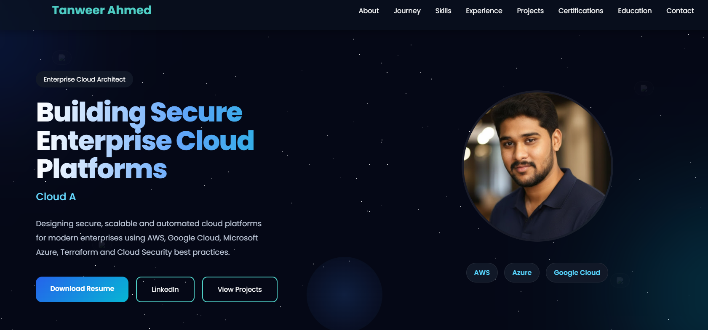

# 🌐 Tanweer Ahmed | Cloud Architect Portfolio

Welcome to my personal portfolio website.

🔗 **Live Website:** https://tanweerahmed.in

---

## 👋 About

This portfolio showcases my experience as a Cloud Architect specializing in:

- ☁️ Amazon Web Services (AWS)
- ☁️ Google Cloud Platform (GCP)
- ☁️ Microsoft Azure
- 🛡 Cloud Security
- ⚙ Terraform
- 🚀 DevSecOps
- 🏗 Enterprise Cloud Architecture

---

## ✨ Features

- Modern responsive UI
- Aurora animated background
- Professional timeline
- Interactive skill progress bars
- Cloud certifications
- Project showcase
- Mobile friendly
- SEO optimized
- Open Graph support
- Custom favicon

---

## 🛠 Technologies Used

- HTML5
- CSS3
- JavaScript
- Bootstrap Icons
- GitHub Pages

---

## 📂 Project Structure

```
tanweerahmed.in/
│
├── index.html
├── style.css
├── script.js
├── images/
├── resume.pdf
└── favicon.png
```

---

## 🚀 Deployment

This website is hosted using **GitHub Pages**.

Any changes pushed to the `main` branch are automatically published.

---

## 🌐 Live Demo

👉 https://tanweerahmed.in

---

## 📸 Preview

(Add a homepage screenshot here)

Example:



---

## 📜 Certifications

- AWS Certified Solutions Architect – Associate
- Google Cloud Associate Cloud Engineer
- Microsoft Cybersecurity Architect Expert
- Microsoft Azure Security Engineer Associate
- Microsoft Azure Data Engineer Associate

---

## 📫 Contact

**Tanweer Ahmed**

🌐 Website: https://tanweerahmed.in

💼 LinkedIn:
https://www.linkedin.com/in/shaik-tanweer-ahmed/

📧 Email:
shaiktanweer5@gmail.com

---

⭐ If you like this portfolio, consider giving this repository a star.
